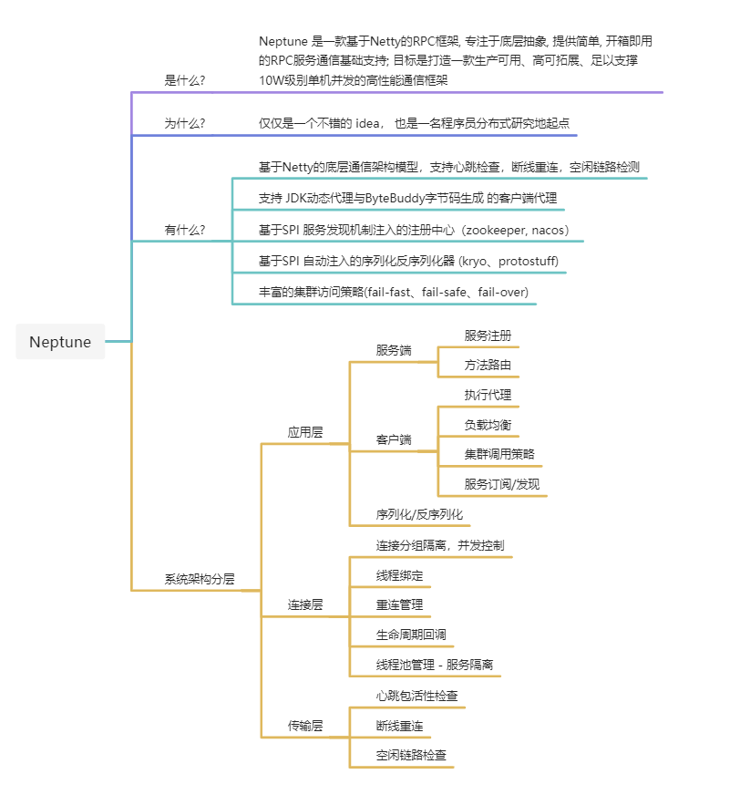
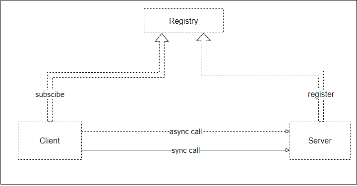
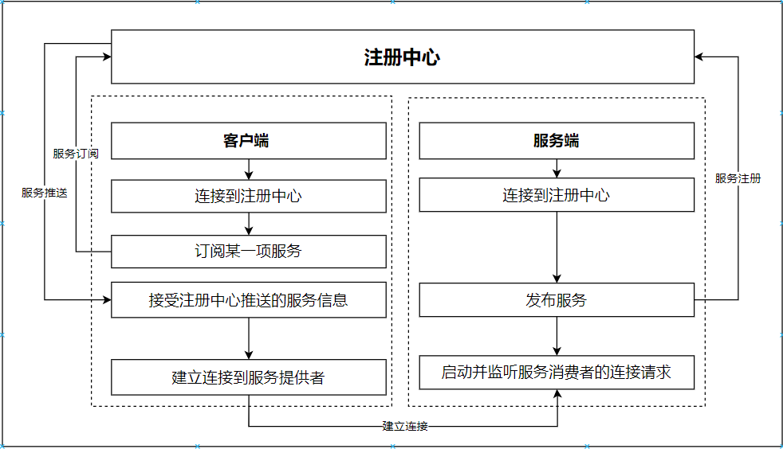
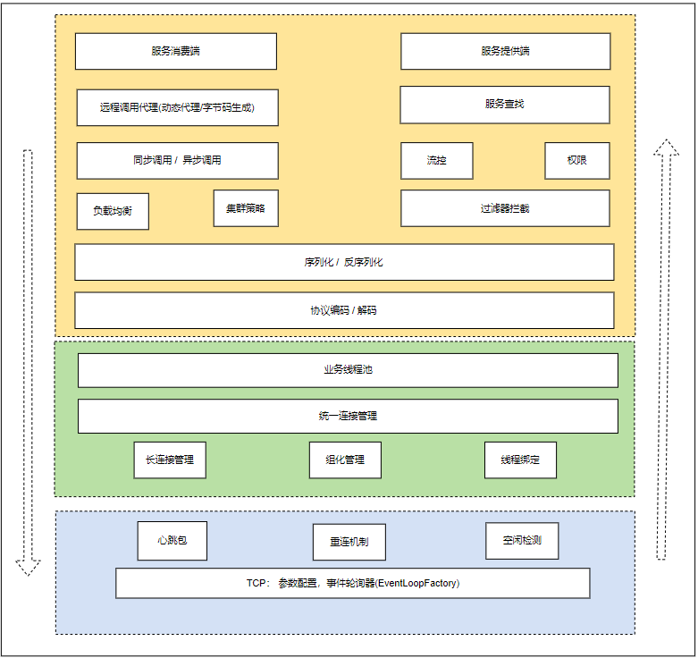

## Neptune

> Neptune 是一个程序员的分布式系统研发的起点

### 项目架构
- 项目说明

- 全局视图

- 启动过程刨析

- 分层模型


### 快速使用
```
TO BE finished 
```


### 文档 & 参考
- [功能完成进度](./docs/project-schedule.md)
- [设计思路](./docs/design.md)
- [参考文档](./docs/design-reference.md)
- [关于优化的思考](./docs/optimizer-thinking.md)

### 参与贡献
1. fork 项目到自己的仓库
2. 分支规范
3. 提交代码
4. 新建Pull Request
5. 经过项目维护人员code review通过后, 可合并到主分支 